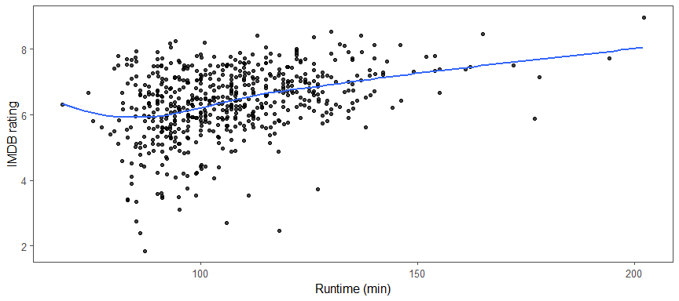
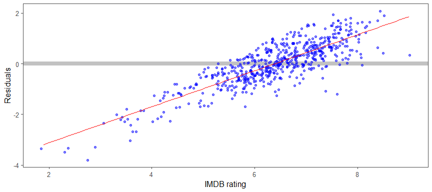

---
  output:
    html_document:
        toc: true
        toc_float: false
        toc_depth: 4
        number_sections: false
  
        code_folding: hide
        code_download: true
  
        fig_width: 9
        fig_height: 4
        fig_align: "center"
        
        highlight: pygments
        theme: cerulean
        
        keep_md: true
        
    title: "IMDB rating prediction"
    subtitle: "Variable importance and prediction"
    author: "by Peter Hontaru"
---
 
## Background

**What are the most important factors in determining the IMDB rating of a movie and can we use a multiple linear regression model to predict this rating?**

This project is based on a fictitious scenario where I’ve been hired as a data scientist at Paramount  Pictures. The data presents numerous variables on movies such as audience/critic ratings, number of votes, runtime, genre, etc. Paramount Pictures is looking to gather insights into determining the acclaim of a film and other novel patterns or ideas. The data set is comprised of 651 randomly sampled movies produced and released before 2016.


* * *

## Part 1: Data

### generabizability

The dataset is comprised of 651 randomly sampled movies produced and released before 2016. Therefore,due to the random sampling, it can be assumed that the data is representative of all movies produced. 

However, as seen below, the earliest date included is 1970 and some years do not have a significant amount of data. Thus, the data is not representative of each year within our sample and this should be considered when interpreting the results. We should also ensure to not extrapolate outside of this year range when calculating predictions.


```r
movies%>%
  group_by(thtr_rel_year)%>%
  summarise(count = n())%>%
  
  ggplot(aes(thtr_rel_year, count))+
  geom_col(col="black", fill = "dark red", width = 1)+
  geom_text(aes(label = count), nudge_y = 3, size = 3)+
  theme_few()+
  theme(axis.text.y = element_blank(),
        axis.ticks.y = element_blank())+
  labs(x = NULL,
       y = NULL,
       title = "Number of movies included within each year")
```


### causality 

Due to the observational nature of the study, no random assignment was used (test/control group), and hence causality cannot be inferred.

* * *

## Part 2: Research question

**What are the most important factors in determining the IMDB rating of a movie and can we use a multiple linear regression model to predict this rating?**

The ability to predict ratings based on film metrics could help:

- understand the popularity of a movie before the full ratings are generated
- inform us if a movie is performing better or worse than expected
- provide insight into which areas to focus for the most desirable outcome

* * *

## Part 3: Exploratory data analysis (EDA)

### Collinearity and Parsimony

We can observe high correlations between our various ratings (IMDB rating, audience score and critics score). We should consider only keeping one of our variables for our final model, but we will explore all of them throughout our EDA.

There's also a high correlation between theatre release year and DVD release year so we should only choose to include one. With the current trend of online streaming (ie. Netflix, Hulu, Amazon), physical DVDs are not as relevant and we can choose to exclude the DVD variables in favour of the theatre ones.


```r
#select all to start
raw_data_corr <- select_if(movies, is.numeric)  

# Compute a correlation matrix
corr <- round(cor(raw_data_corr, use="complete.obs"),2)

# Compute a matrix of correlation p-values
p.mat <- cor_pmat(raw_data_corr)

# Visualize the correlation matrix
ggcorrplot(corr, method = "square", 
           ggtheme = ggthemes::theme_few, 
           #title = "We can observe some clear patterns",
           
           outline.col = "black",
           colors = c("blue","white", "red"),
           
           lab = TRUE,
           lab_size = 2.5,
           digits = 2,
           
           type = "lower",
           legend = "",
           tl.cex = 8,
           #show insignificant ones as blank
           p.mat = p.mat,
           hc.order = TRUE,
           insig = "blank")
```


```r
movies <- movies%>%
  select(-dvd_rel_year, -dvd_rel_month, -dvd_rel_day)
```

### Which types of film are included in our analysis?

We can see that the majority of the movies were within the Feature Film category. Given that Paramount operates in this area (rather than documentaries or TV shows), we will also focus our analysis/model on this category.


```r
movies%>%
  group_by(title_type)%>%
  summarise(count = n())%>%
  mutate(prop = round(count/sum(count)*100,0))%>%
  
  ggplot(aes(title_type, prop))+
  geom_col(col="black", fill = "dark red")+
  geom_text(aes(label = paste(count, " - (", prop, "%)", sep = "")), nudge_y = 5, size = 5)+
  theme_few()+
  theme(axis.text.y = element_blank(),
        axis.ticks.y = element_blank())+
  labs(x = NULL,
       y = NULL)
```


```r
movies <- movies%>%
  filter(title_type == "Feature Film")%>%
  select(-title_type)
```

### Which genres are included in our analysis?

The majority of our data contains Drama movies(51%), followed by Comedy(14%) and Action and Adventure(11%). We can see that we still have a few documentaries left, even though we removed them based on type. We will also remove this subset for the same reason as before.


```r
movie_genre <- movies%>%
  group_by(genre)%>%
  summarise(count = n())%>%
  mutate(proportion = round(count/sum(count)*100,1))%>%
  arrange(desc(count))
  
  movie_genre%>%
  kbl(caption = "Summary of movie genres")%>%
  kable_paper("hover", full_width = F)
```

<table class=" lightable-paper lightable-hover" style='font-family: "Arial Narrow", arial, helvetica, sans-serif; width: auto !important; margin-left: auto; margin-right: auto;'>
<caption>Summary of movie genres</caption>
 <thead>
  <tr>
   <th style="text-align:left;"> genre </th>
   <th style="text-align:right;"> count </th>
   <th style="text-align:right;"> proportion </th>
  </tr>
 </thead>
<tbody>
  <tr>
   <td style="text-align:left;"> Drama </td>
   <td style="text-align:right;"> 301 </td>
   <td style="text-align:right;"> 50.9 </td>
  </tr>
  <tr>
   <td style="text-align:left;"> Comedy </td>
   <td style="text-align:right;"> 85 </td>
   <td style="text-align:right;"> 14.4 </td>
  </tr>
  <tr>
   <td style="text-align:left;"> Action &amp; Adventure </td>
   <td style="text-align:right;"> 65 </td>
   <td style="text-align:right;"> 11.0 </td>
  </tr>
  <tr>
   <td style="text-align:left;"> Mystery &amp; Suspense </td>
   <td style="text-align:right;"> 59 </td>
   <td style="text-align:right;"> 10.0 </td>
  </tr>
  <tr>
   <td style="text-align:left;"> Horror </td>
   <td style="text-align:right;"> 23 </td>
   <td style="text-align:right;"> 3.9 </td>
  </tr>
  <tr>
   <td style="text-align:left;"> Other </td>
   <td style="text-align:right;"> 15 </td>
   <td style="text-align:right;"> 2.5 </td>
  </tr>
  <tr>
   <td style="text-align:left;"> Art House &amp; International </td>
   <td style="text-align:right;"> 14 </td>
   <td style="text-align:right;"> 2.4 </td>
  </tr>
  <tr>
   <td style="text-align:left;"> Animation </td>
   <td style="text-align:right;"> 9 </td>
   <td style="text-align:right;"> 1.5 </td>
  </tr>
  <tr>
   <td style="text-align:left;"> Science Fiction &amp; Fantasy </td>
   <td style="text-align:right;"> 9 </td>
   <td style="text-align:right;"> 1.5 </td>
  </tr>
  <tr>
   <td style="text-align:left;"> Musical &amp; Performing Arts </td>
   <td style="text-align:right;"> 8 </td>
   <td style="text-align:right;"> 1.4 </td>
  </tr>
  <tr>
   <td style="text-align:left;"> Documentary </td>
   <td style="text-align:right;"> 3 </td>
   <td style="text-align:right;"> 0.5 </td>
  </tr>
</tbody>
</table>

```r
  movies <- movies%>%
    filter(genre != "Documentary")
```

### Are the IMDB ratings impacted by the genre?

We can observe significant differences between the various genres and metrics such as variance, medians, range and outliers.


```r
  ggplot(movies, aes(genre, imdb_rating, col = genre))+
  geom_boxplot(show.legend = FALSE)+
  geom_jitter(alpha = 0.1, show.legend = FALSE)+
  coord_flip()+
  labs(y = "IMDB rating")+
  theme_few()+
  labs(x=NULL)
```


### Is there an association between the IMDB rating and the total amount of IMDB votes?

The high-performing movies (as measured by IMDB rating) also have a higher number of votes. This trend seems exponential towards the higher IMDB ratings/votes, where the increase in total number of votes is much higher than in the low/medium ranges.


```r
movies%>%
  ggplot(aes(imdb_rating, imdb_num_votes))+
  geom_jitter(width=0.1, height = 0.1, alpha = 0.5)+
  geom_smooth(se = FALSE)+
  theme_few()+
  labs(x = "IMDB rating",
       y = "Total IMDB votes")+
  theme(legend.position = "none")
```


### Do movie critics and audiences share the same taste in movies?

Judging by the variances in our scatter plots, we can observe fairly large discrepancies between how audiences and critics perceive movies. This is even more apparent in genres such as Action & Adventure and Comedy, where audiences tend to give much higher ratings than the critics.


```r
movies%>%
  ggplot(aes(audience_score, critics_score, col = genre))+
  geom_jitter(width=0.1, height = 0.1, show.legend = FALSE)+
  facet_wrap(.~genre)+
  theme_few()+
  annotate("segment", x=-Inf, xend=Inf, y=-Inf, yend=Inf, alpha = 0.5, lty = 2)+
  theme(legend.position = "none")+
  labs(x = "Audience score",
       y = "Critics score")
```


We can focus more on these differences by looking in average scores for each genre. Below, we can observe very large differences between the various genres.


```r
movies %>%
  select(genre, audience_score, critics_score)%>%
  group_by(genre)%>%
  summarise(audience_score = mean(audience_score),
            critics_score = mean(critics_score))%>%
  mutate(difference_score = round((audience_score - critics_score), 1),
         status = ifelse(abs(difference_score) <=3, "good (lower than 3)", 
                         ifelse(abs(difference_score) <=5, "ok (between 3 and 5)", "bad (higher than 5)")))%>%
#create plot        
  ggplot(aes(reorder(genre, difference_score), difference_score, fill = status))+
  geom_col(col = "black")+
  scale_fill_manual(values = c("dark red", "#009E73", "gold3"))+
  scale_colour_manual(values = c("dark red", "#009E73", "gold3"))+
  geom_label(aes(genre, difference_score + ifelse(difference_score >= 0, +0.2, -0.2), label = difference_score), show.legend = FALSE, size = 3, fill = "white")+
  labs(x=NULL,
       y="Points disagreement",
       title = "Rating disagreement between critics and audiences",
       subtitle = "A positive score means the audience rated higher than critics",
       fill = "Status")+
  theme(legend.position = "top",
        axis.ticks.x = element_blank(),
        axis.text.x = element_blank())+
  coord_flip()+
  theme_few()
```


### Is there an association between the year a movie was released in and the IMDB rating?

Given that we have the number of votes for each IMDB rating, we will use a weighted mean for this comparison.

While the total number of votes increased, as shown by the size of the points, we can see that the overall rating was fairly consistent. Again, to note the relatively low sample size of movies released before ~1990.


```r
movies%>%
  group_by(thtr_rel_year)%>%
  summarise(imdb_wmean = weighted.mean(imdb_rating, imdb_num_votes),
            count = n(),
            votes = sum(imdb_num_votes))%>%

ggplot(aes(thtr_rel_year, imdb_wmean))+
  geom_point(aes(size = votes), show.legend = FALSE)+
  geom_line()+
  coord_cartesian(ylim = c(0,10))+
  labs(x = NULL,
       y = "IMDB rating",
       subtitle = "Size of point shows the relative sample of number of votes within each year")+
  theme_few()
```


### Are there any associations between the IMDB rating and the month of release?

It seems that the release dates are fairly equal distributed across the year (width of the bar) as well as equal in variance. Thus, we can say that it looks like these factors are independent of each other.


```r
movies%>%
  mutate(thtr_rel_month = as.factor(thtr_rel_month))%>%
  
ggplot(aes(thtr_rel_month, imdb_rating, col = thtr_rel_month))+
  geom_boxplot(aes(group = thtr_rel_month), varwidth = TRUE, show.legend = FALSE)+
  geom_jitter(alpha = 0.1, show.legend = FALSE)+
  labs(x = "Month",
       y = "IMDB rating")+
  theme_few()
```


### Is there an association between the day of the week a movie was released and the IMDB rating?

Both the boxplot and table below show that almost 75% of movie releases happen on a Friday and 11% on a Wednesday. An squal split of around 2-3% each happen on the other days. While the sample sizes are different across the various weekdays, there doesn't seem to be a clear trend regarding the IMDB rating. Both audiences and critics tend to agree that movies released on Monday, Tuesday and Friday perform worse than the rest.


```r
day_of_week <- movies%>%
  mutate(date = make_date(thtr_rel_year, thtr_rel_month, thtr_rel_day),
         wday = weekdays.Date(date),
         wday_num = wday(date, week_start = 1))%>%
  group_by(wday, wday_num)%>%
  summarise(count = n(),
            votes = round(mean(imdb_num_votes)),
            imdb_wmean = weighted.mean(imdb_rating, imdb_num_votes),
            audience_score = round(mean(audience_score),1),
            critics_score = round(mean(critics_score),1),
            imdb_wmean = round(imdb_wmean, 1))%>%
  ungroup()%>%
  mutate(prop = round(count/sum(count)*100,1))%>%
  arrange(wday_num)

#add the weekday column to our model
movies <- movies%>%
  mutate(date = make_date(thtr_rel_year, thtr_rel_month, thtr_rel_day),
         wday = as.factor(weekdays.Date(date)),
         wday_num = wday(date, week_start = 1))%>%
  select(-date)

ggplot(movies, aes(reorder(wday,wday_num), imdb_rating, col = wday))+
  geom_boxplot(show.legend = FALSE, varwidth = TRUE)+
  geom_jitter(alpha = 0.1, show.legend = FALSE)+
  labs(x = NULL,
       y = "IMDB rating")+
  theme_few()
```


```r
  day_of_week%>%
  kbl(caption = "Proportion of releases by day of week")%>%
  kable_paper("hover", full_width = F)
```

<table class=" lightable-paper lightable-hover" style='font-family: "Arial Narrow", arial, helvetica, sans-serif; width: auto !important; margin-left: auto; margin-right: auto;'>
<caption>Proportion of releases by day of week</caption>
 <thead>
  <tr>
   <th style="text-align:left;"> wday </th>
   <th style="text-align:right;"> wday_num </th>
   <th style="text-align:right;"> count </th>
   <th style="text-align:right;"> votes </th>
   <th style="text-align:right;"> imdb_wmean </th>
   <th style="text-align:right;"> audience_score </th>
   <th style="text-align:right;"> critics_score </th>
   <th style="text-align:right;"> prop </th>
  </tr>
 </thead>
<tbody>
  <tr>
   <td style="text-align:left;"> Monday </td>
   <td style="text-align:right;"> 1 </td>
   <td style="text-align:right;"> 12 </td>
   <td style="text-align:right;"> 35906 </td>
   <td style="text-align:right;"> 7.0 </td>
   <td style="text-align:right;"> 57.8 </td>
   <td style="text-align:right;"> 52.1 </td>
   <td style="text-align:right;"> 2.0 </td>
  </tr>
  <tr>
   <td style="text-align:left;"> Tuesday </td>
   <td style="text-align:right;"> 2 </td>
   <td style="text-align:right;"> 20 </td>
   <td style="text-align:right;"> 104076 </td>
   <td style="text-align:right;"> 8.1 </td>
   <td style="text-align:right;"> 58.1 </td>
   <td style="text-align:right;"> 57.3 </td>
   <td style="text-align:right;"> 3.4 </td>
  </tr>
  <tr>
   <td style="text-align:left;"> Wednesday </td>
   <td style="text-align:right;"> 3 </td>
   <td style="text-align:right;"> 65 </td>
   <td style="text-align:right;"> 62649 </td>
   <td style="text-align:right;"> 7.3 </td>
   <td style="text-align:right;"> 67.4 </td>
   <td style="text-align:right;"> 65.7 </td>
   <td style="text-align:right;"> 11.1 </td>
  </tr>
  <tr>
   <td style="text-align:left;"> Thursday </td>
   <td style="text-align:right;"> 4 </td>
   <td style="text-align:right;"> 23 </td>
   <td style="text-align:right;"> 54167 </td>
   <td style="text-align:right;"> 6.9 </td>
   <td style="text-align:right;"> 66.2 </td>
   <td style="text-align:right;"> 65.4 </td>
   <td style="text-align:right;"> 3.9 </td>
  </tr>
  <tr>
   <td style="text-align:left;"> Friday </td>
   <td style="text-align:right;"> 5 </td>
   <td style="text-align:right;"> 430 </td>
   <td style="text-align:right;"> 65142 </td>
   <td style="text-align:right;"> 7.1 </td>
   <td style="text-align:right;"> 58.8 </td>
   <td style="text-align:right;"> 51.2 </td>
   <td style="text-align:right;"> 73.1 </td>
  </tr>
  <tr>
   <td style="text-align:left;"> Saturday </td>
   <td style="text-align:right;"> 6 </td>
   <td style="text-align:right;"> 20 </td>
   <td style="text-align:right;"> 43208 </td>
   <td style="text-align:right;"> 7.3 </td>
   <td style="text-align:right;"> 67.1 </td>
   <td style="text-align:right;"> 71.9 </td>
   <td style="text-align:right;"> 3.4 </td>
  </tr>
  <tr>
   <td style="text-align:left;"> Sunday </td>
   <td style="text-align:right;"> 7 </td>
   <td style="text-align:right;"> 18 </td>
   <td style="text-align:right;"> 22631 </td>
   <td style="text-align:right;"> 7.1 </td>
   <td style="text-align:right;"> 62.4 </td>
   <td style="text-align:right;"> 68.6 </td>
   <td style="text-align:right;"> 3.1 </td>
  </tr>
</tbody>
</table>

### Does the runtime of the movie affect the IMDB rating?

We can see a slight trend where movies of a longer length correlate with a higher IMDB rating. However, this is not causal and it could be that this is an indirect effect of the genre of the movie (and thus, longer movies are of a favourable genre).


```r
ggplot(movies, aes(runtime, imdb_rating))+
  geom_jitter(width = 0.1, height = 0.1, alpha = 0.75)+
  geom_smooth(se=FALSE)+
  theme_few()+
  labs(x = "Runtime (min)",
       y = "IMDB rating")
```



### Where does Paramount Pictures rank amogst the various other studios?

Based on movie averages, Paramount Pictures is ranked somewhere at the top, based on the IMDB rating/number of total votes and just above average regarding audience ratings.


```r
studios <- movies%>%
  group_by(studio)%>%
  summarise(imdb_wmean = weighted.mean(imdb_rating, imdb_num_votes),
            audience_score = mean(audience_score, na.rm = TRUE),
            count = n(),
            avg_votes = sum(imdb_num_votes)/count)

paramount_studio <- studios%>%
  filter(studio == "Paramount Pictures")

ggplot()+
  geom_point(data = studios, aes(audience_score, imdb_wmean, size = avg_votes), show.legend = FALSE, alpha = 0.6)+
  geom_text(data = paramount_studio, aes(audience_score, imdb_wmean, label = "Paramount"), col = "red", size = 5, nudge_y = 0.3)+
  geom_point(data = paramount_studio, aes(audience_score, imdb_wmean), col = "red", size = 3.7)+
  labs(x = "Audience score",
       y = "IMDB rating",
       subtitle = "Size of point shows the relative sample of number of votes within each year (average per studio)")+
  theme_few()
```


### Is there an association between the type of an award a movie receives and the rating?

We can notice significant differences for the bottom three awards, but not nothing significant between those that received the top 3 awards in the below boxplot.


```r
awards <- movies%>%
  select(audience_score, critics_score, imdb_rating, imdb_num_votes, best_pic_nom:top200_box)%>%
  gather(Award, Status, -audience_score, -critics_score, -imdb_rating, -imdb_num_votes)

ggplot(awards, aes(Status, imdb_rating, col = Status))+
  geom_boxplot()+
  theme_few()+
  labs(col = "Award received",
       x = NULL,
       y = "IMDB rating")+
  facet_wrap(.~Award)+
  theme(legend.position = "top")
```


The same trend can be seen below where movies that have received the bottom 3 awards tend to perform better than those who have not on either movie rating score.


```r
  award_yes <- awards%>%
  filter(Status == "yes")

  ggplot(awards, aes(critics_score, imdb_rating, col = Status))+
  geom_point(alpha = 0.50)+
  geom_point(data = award_yes, aes(critics_score, imdb_rating), col = "dark red")+
  theme_few()+
  scale_colour_manual(values = c("gold3", "dark red"))+
  labs(col = "Award received",
       x = "Critics score",
       y = "IMDB rating")+
  facet_wrap(.~Award)+
  theme(legend.position = "top")
```


We can also spot a trend where, generally speaking, the rarer the award, the higher the chance it would impact any of the ratings in a favourable way.


```r
awards_table <- awards%>%
    group_by(Award, Status)%>%
    summarise(count = n(),
              audience_score = round(mean(audience_score),1),
              critics_score = round(mean(critics_score),1),
              imdb_rating = round(weighted.mean(imdb_rating, imdb_num_votes),1),
              imdb_num_votes = round(mean(imdb_num_votes),0))%>%
  mutate(proportion = round(count/sum(count)*100,1))%>%
  arrange(proportion)

awards_table%>%
  kbl(caption = "Summary of awards and movie ratings")%>%
  kable_paper("hover", full_width = F)
```

<table class=" lightable-paper lightable-hover" style='font-family: "Arial Narrow", arial, helvetica, sans-serif; width: auto !important; margin-left: auto; margin-right: auto;'>
<caption>Summary of awards and movie ratings</caption>
 <thead>
  <tr>
   <th style="text-align:left;"> Award </th>
   <th style="text-align:left;"> Status </th>
   <th style="text-align:right;"> count </th>
   <th style="text-align:right;"> audience_score </th>
   <th style="text-align:right;"> critics_score </th>
   <th style="text-align:right;"> imdb_rating </th>
   <th style="text-align:right;"> imdb_num_votes </th>
   <th style="text-align:right;"> proportion </th>
  </tr>
 </thead>
<tbody>
  <tr>
   <td style="text-align:left;"> best_pic_win </td>
   <td style="text-align:left;"> yes </td>
   <td style="text-align:right;"> 7 </td>
   <td style="text-align:right;"> 84.7 </td>
   <td style="text-align:right;"> 91.3 </td>
   <td style="text-align:right;"> 8.1 </td>
   <td style="text-align:right;"> 399420 </td>
   <td style="text-align:right;"> 1.2 </td>
  </tr>
  <tr>
   <td style="text-align:left;"> top200_box </td>
   <td style="text-align:left;"> yes </td>
   <td style="text-align:right;"> 15 </td>
   <td style="text-align:right;"> 74.5 </td>
   <td style="text-align:right;"> 75.5 </td>
   <td style="text-align:right;"> 7.4 </td>
   <td style="text-align:right;"> 269876 </td>
   <td style="text-align:right;"> 2.6 </td>
  </tr>
  <tr>
   <td style="text-align:left;"> best_pic_nom </td>
   <td style="text-align:left;"> yes </td>
   <td style="text-align:right;"> 22 </td>
   <td style="text-align:right;"> 85.3 </td>
   <td style="text-align:right;"> 87.5 </td>
   <td style="text-align:right;"> 8.1 </td>
   <td style="text-align:right;"> 253804 </td>
   <td style="text-align:right;"> 3.7 </td>
  </tr>
  <tr>
   <td style="text-align:left;"> best_dir_win </td>
   <td style="text-align:left;"> yes </td>
   <td style="text-align:right;"> 43 </td>
   <td style="text-align:right;"> 69.5 </td>
   <td style="text-align:right;"> 72.1 </td>
   <td style="text-align:right;"> 7.7 </td>
   <td style="text-align:right;"> 137816 </td>
   <td style="text-align:right;"> 7.3 </td>
  </tr>
  <tr>
   <td style="text-align:left;"> best_actress_win </td>
   <td style="text-align:left;"> yes </td>
   <td style="text-align:right;"> 70 </td>
   <td style="text-align:right;"> 63.6 </td>
   <td style="text-align:right;"> 61.7 </td>
   <td style="text-align:right;"> 7.5 </td>
   <td style="text-align:right;"> 98932 </td>
   <td style="text-align:right;"> 11.9 </td>
  </tr>
  <tr>
   <td style="text-align:left;"> best_actor_win </td>
   <td style="text-align:left;"> yes </td>
   <td style="text-align:right;"> 91 </td>
   <td style="text-align:right;"> 62.7 </td>
   <td style="text-align:right;"> 60.2 </td>
   <td style="text-align:right;"> 7.4 </td>
   <td style="text-align:right;"> 82086 </td>
   <td style="text-align:right;"> 15.5 </td>
  </tr>
  <tr>
   <td style="text-align:left;"> best_actor_win </td>
   <td style="text-align:left;"> no </td>
   <td style="text-align:right;"> 497 </td>
   <td style="text-align:right;"> 60.0 </td>
   <td style="text-align:right;"> 53.9 </td>
   <td style="text-align:right;"> 7.1 </td>
   <td style="text-align:right;"> 59644 </td>
   <td style="text-align:right;"> 84.5 </td>
  </tr>
  <tr>
   <td style="text-align:left;"> best_actress_win </td>
   <td style="text-align:left;"> no </td>
   <td style="text-align:right;"> 518 </td>
   <td style="text-align:right;"> 60.0 </td>
   <td style="text-align:right;"> 53.9 </td>
   <td style="text-align:right;"> 7.1 </td>
   <td style="text-align:right;"> 58278 </td>
   <td style="text-align:right;"> 88.1 </td>
  </tr>
  <tr>
   <td style="text-align:left;"> best_dir_win </td>
   <td style="text-align:left;"> no </td>
   <td style="text-align:right;"> 545 </td>
   <td style="text-align:right;"> 59.7 </td>
   <td style="text-align:right;"> 53.5 </td>
   <td style="text-align:right;"> 7.1 </td>
   <td style="text-align:right;"> 57224 </td>
   <td style="text-align:right;"> 92.7 </td>
  </tr>
  <tr>
   <td style="text-align:left;"> best_pic_nom </td>
   <td style="text-align:left;"> no </td>
   <td style="text-align:right;"> 566 </td>
   <td style="text-align:right;"> 59.4 </td>
   <td style="text-align:right;"> 53.6 </td>
   <td style="text-align:right;"> 7.0 </td>
   <td style="text-align:right;"> 55705 </td>
   <td style="text-align:right;"> 96.3 </td>
  </tr>
  <tr>
   <td style="text-align:left;"> top200_box </td>
   <td style="text-align:left;"> no </td>
   <td style="text-align:right;"> 573 </td>
   <td style="text-align:right;"> 60.0 </td>
   <td style="text-align:right;"> 54.3 </td>
   <td style="text-align:right;"> 7.2 </td>
   <td style="text-align:right;"> 57705 </td>
   <td style="text-align:right;"> 97.4 </td>
  </tr>
  <tr>
   <td style="text-align:left;"> best_pic_win </td>
   <td style="text-align:left;"> no </td>
   <td style="text-align:right;"> 581 </td>
   <td style="text-align:right;"> 60.1 </td>
   <td style="text-align:right;"> 54.4 </td>
   <td style="text-align:right;"> 7.1 </td>
   <td style="text-align:right;"> 59066 </td>
   <td style="text-align:right;"> 98.8 </td>
  </tr>
</tbody>
</table>

* * *

## Part 4: Modeling

### Feature selection

We will be excluding the following variables from our **full model**:

- title, studio as they might cause our model to overfit
- critics/audience ratings and scores as they are highly correlated with our predicted variables (IMDB rating)
- number of IMDB ratings as it would act as a proxy for the IMDB rating (they're also correlated)
- DVD release year, month and day for reasons mention before (high correlation with theatre release dates and lack of importance given current streaming trends)

**Feature engineering**: we also added day of the week to see if there are any trends

### Selection method

We chose a backward p value adjustment to our model, given the context of the study where we could not use an automated way to reduce variables. An R adjustment would be incredibly time-consuming given the manual methodology and prone to human error. Furthermore, a p value adjustment would ensure that the factors included are significant (which is not necessarily true in an R adjustment).


```r
model_initial <- lm(imdb_rating ~ genre + runtime + mpaa_rating + thtr_rel_year + thtr_rel_month + thtr_rel_day + best_pic_nom + best_pic_win + best_actor_win + best_actress_win + best_dir_win + top200_box + wday, data=movies)

tidy(model_initial)%>%
  arrange(term, p.value)%>%
  kbl(caption = "Initial model - summary")%>%
  kable_paper("hover", full_width = F)
```

<table class=" lightable-paper lightable-hover" style='font-family: "Arial Narrow", arial, helvetica, sans-serif; width: auto !important; margin-left: auto; margin-right: auto;'>
<caption>Initial model - summary</caption>
 <thead>
  <tr>
   <th style="text-align:left;"> term </th>
   <th style="text-align:right;"> estimate </th>
   <th style="text-align:right;"> std.error </th>
   <th style="text-align:right;"> statistic </th>
   <th style="text-align:right;"> p.value </th>
  </tr>
 </thead>
<tbody>
  <tr>
   <td style="text-align:left;"> (Intercept) </td>
   <td style="text-align:right;"> 8.1742438 </td>
   <td style="text-align:right;"> 7.9644193 </td>
   <td style="text-align:right;"> 1.0263452 </td>
   <td style="text-align:right;"> 0.3051744 </td>
  </tr>
  <tr>
   <td style="text-align:left;"> best_actor_winyes </td>
   <td style="text-align:right;"> -0.0711392 </td>
   <td style="text-align:right;"> 0.1125253 </td>
   <td style="text-align:right;"> -0.6322066 </td>
   <td style="text-align:right;"> 0.5275113 </td>
  </tr>
  <tr>
   <td style="text-align:left;"> best_actress_winyes </td>
   <td style="text-align:right;"> 0.0044981 </td>
   <td style="text-align:right;"> 0.1237113 </td>
   <td style="text-align:right;"> 0.0363600 </td>
   <td style="text-align:right;"> 0.9710083 </td>
  </tr>
  <tr>
   <td style="text-align:left;"> best_dir_winyes </td>
   <td style="text-align:right;"> 0.3188387 </td>
   <td style="text-align:right;"> 0.1590998 </td>
   <td style="text-align:right;"> 2.0040174 </td>
   <td style="text-align:right;"> 0.0455519 </td>
  </tr>
  <tr>
   <td style="text-align:left;"> best_pic_nomyes </td>
   <td style="text-align:right;"> 0.8816059 </td>
   <td style="text-align:right;"> 0.2389923 </td>
   <td style="text-align:right;"> 3.6888459 </td>
   <td style="text-align:right;"> 0.0002474 </td>
  </tr>
  <tr>
   <td style="text-align:left;"> best_pic_winyes </td>
   <td style="text-align:right;"> -0.1331604 </td>
   <td style="text-align:right;"> 0.4210997 </td>
   <td style="text-align:right;"> -0.3162206 </td>
   <td style="text-align:right;"> 0.7519535 </td>
  </tr>
  <tr>
   <td style="text-align:left;"> genreAnimation </td>
   <td style="text-align:right;"> -0.1133041 </td>
   <td style="text-align:right;"> 0.3741316 </td>
   <td style="text-align:right;"> -0.3028455 </td>
   <td style="text-align:right;"> 0.7621207 </td>
  </tr>
  <tr>
   <td style="text-align:left;"> genreArt House &amp; International </td>
   <td style="text-align:right;"> 0.5010347 </td>
   <td style="text-align:right;"> 0.2879901 </td>
   <td style="text-align:right;"> 1.7397636 </td>
   <td style="text-align:right;"> 0.0824529 </td>
  </tr>
  <tr>
   <td style="text-align:left;"> genreComedy </td>
   <td style="text-align:right;"> -0.0658930 </td>
   <td style="text-align:right;"> 0.1555755 </td>
   <td style="text-align:right;"> -0.4235434 </td>
   <td style="text-align:right;"> 0.6720624 </td>
  </tr>
  <tr>
   <td style="text-align:left;"> genreDrama </td>
   <td style="text-align:right;"> 0.5711587 </td>
   <td style="text-align:right;"> 0.1325883 </td>
   <td style="text-align:right;"> 4.3077606 </td>
   <td style="text-align:right;"> 0.0000195 </td>
  </tr>
  <tr>
   <td style="text-align:left;"> genreHorror </td>
   <td style="text-align:right;"> -0.1636790 </td>
   <td style="text-align:right;"> 0.2321635 </td>
   <td style="text-align:right;"> -0.7050161 </td>
   <td style="text-align:right;"> 0.4810949 </td>
  </tr>
  <tr>
   <td style="text-align:left;"> genreMusical &amp; Performing Arts </td>
   <td style="text-align:right;"> 0.9702023 </td>
   <td style="text-align:right;"> 0.3466066 </td>
   <td style="text-align:right;"> 2.7991452 </td>
   <td style="text-align:right;"> 0.0053014 </td>
  </tr>
  <tr>
   <td style="text-align:left;"> genreMystery &amp; Suspense </td>
   <td style="text-align:right;"> 0.4188761 </td>
   <td style="text-align:right;"> 0.1730444 </td>
   <td style="text-align:right;"> 2.4206272 </td>
   <td style="text-align:right;"> 0.0158125 </td>
  </tr>
  <tr>
   <td style="text-align:left;"> genreOther </td>
   <td style="text-align:right;"> 0.5762551 </td>
   <td style="text-align:right;"> 0.2713937 </td>
   <td style="text-align:right;"> 2.1233178 </td>
   <td style="text-align:right;"> 0.0341675 </td>
  </tr>
  <tr>
   <td style="text-align:left;"> genreScience Fiction &amp; Fantasy </td>
   <td style="text-align:right;"> -0.2579984 </td>
   <td style="text-align:right;"> 0.3285955 </td>
   <td style="text-align:right;"> -0.7851551 </td>
   <td style="text-align:right;"> 0.4326965 </td>
  </tr>
  <tr>
   <td style="text-align:left;"> mpaa_ratingNC-17 </td>
   <td style="text-align:right;"> -0.3952647 </td>
   <td style="text-align:right;"> 0.7098442 </td>
   <td style="text-align:right;"> -0.5568330 </td>
   <td style="text-align:right;"> 0.5778652 </td>
  </tr>
  <tr>
   <td style="text-align:left;"> mpaa_ratingPG </td>
   <td style="text-align:right;"> -0.5859253 </td>
   <td style="text-align:right;"> 0.2845822 </td>
   <td style="text-align:right;"> -2.0588966 </td>
   <td style="text-align:right;"> 0.0399685 </td>
  </tr>
  <tr>
   <td style="text-align:left;"> mpaa_ratingPG-13 </td>
   <td style="text-align:right;"> -0.7732551 </td>
   <td style="text-align:right;"> 0.2979153 </td>
   <td style="text-align:right;"> -2.5955536 </td>
   <td style="text-align:right;"> 0.0096929 </td>
  </tr>
  <tr>
   <td style="text-align:left;"> mpaa_ratingR </td>
   <td style="text-align:right;"> -0.4397807 </td>
   <td style="text-align:right;"> 0.2897715 </td>
   <td style="text-align:right;"> -1.5176811 </td>
   <td style="text-align:right;"> 0.1296621 </td>
  </tr>
  <tr>
   <td style="text-align:left;"> mpaa_ratingUnrated </td>
   <td style="text-align:right;"> 0.0134913 </td>
   <td style="text-align:right;"> 0.3910641 </td>
   <td style="text-align:right;"> 0.0344990 </td>
   <td style="text-align:right;"> 0.9724916 </td>
  </tr>
  <tr>
   <td style="text-align:left;"> runtime </td>
   <td style="text-align:right;"> 0.0124955 </td>
   <td style="text-align:right;"> 0.0027001 </td>
   <td style="text-align:right;"> 4.6277832 </td>
   <td style="text-align:right;"> 0.0000046 </td>
  </tr>
  <tr>
   <td style="text-align:left;"> thtr_rel_day </td>
   <td style="text-align:right;"> 0.0005832 </td>
   <td style="text-align:right;"> 0.0044814 </td>
   <td style="text-align:right;"> 0.1301413 </td>
   <td style="text-align:right;"> 0.8965016 </td>
  </tr>
  <tr>
   <td style="text-align:left;"> thtr_rel_month </td>
   <td style="text-align:right;"> 0.0042229 </td>
   <td style="text-align:right;"> 0.0113959 </td>
   <td style="text-align:right;"> 0.3705581 </td>
   <td style="text-align:right;"> 0.7111076 </td>
  </tr>
  <tr>
   <td style="text-align:left;"> thtr_rel_year </td>
   <td style="text-align:right;"> -0.0015561 </td>
   <td style="text-align:right;"> 0.0039896 </td>
   <td style="text-align:right;"> -0.3900363 </td>
   <td style="text-align:right;"> 0.6966588 </td>
  </tr>
  <tr>
   <td style="text-align:left;"> top200_boxyes </td>
   <td style="text-align:right;"> 0.5304606 </td>
   <td style="text-align:right;"> 0.2501291 </td>
   <td style="text-align:right;"> 2.1207471 </td>
   <td style="text-align:right;"> 0.0343843 </td>
  </tr>
  <tr>
   <td style="text-align:left;"> wdayMonday </td>
   <td style="text-align:right;"> -0.1617262 </td>
   <td style="text-align:right;"> 0.2759457 </td>
   <td style="text-align:right;"> -0.5860798 </td>
   <td style="text-align:right;"> 0.5580593 </td>
  </tr>
  <tr>
   <td style="text-align:left;"> wdaySaturday </td>
   <td style="text-align:right;"> 0.4156167 </td>
   <td style="text-align:right;"> 0.2156469 </td>
   <td style="text-align:right;"> 1.9273016 </td>
   <td style="text-align:right;"> 0.0544503 </td>
  </tr>
  <tr>
   <td style="text-align:left;"> wdaySunday </td>
   <td style="text-align:right;"> 0.2682264 </td>
   <td style="text-align:right;"> 0.2287683 </td>
   <td style="text-align:right;"> 1.1724810 </td>
   <td style="text-align:right;"> 0.2415052 </td>
  </tr>
  <tr>
   <td style="text-align:left;"> wdayThursday </td>
   <td style="text-align:right;"> 0.3603500 </td>
   <td style="text-align:right;"> 0.2023244 </td>
   <td style="text-align:right;"> 1.7810508 </td>
   <td style="text-align:right;"> 0.0754490 </td>
  </tr>
  <tr>
   <td style="text-align:left;"> wdayTuesday </td>
   <td style="text-align:right;"> 0.0488718 </td>
   <td style="text-align:right;"> 0.2158849 </td>
   <td style="text-align:right;"> 0.2263792 </td>
   <td style="text-align:right;"> 0.8209896 </td>
  </tr>
  <tr>
   <td style="text-align:left;"> wdayWednesday </td>
   <td style="text-align:right;"> 0.1893176 </td>
   <td style="text-align:right;"> 0.1287452 </td>
   <td style="text-align:right;"> 1.4704825 </td>
   <td style="text-align:right;"> 0.1419958 </td>
  </tr>
</tbody>
</table>

```r
# removed best_actor_win
model_final <- lm(imdb_rating ~ genre + runtime + mpaa_rating + thtr_rel_year + thtr_rel_month + thtr_rel_day + best_pic_nom + best_pic_win + best_actress_win + best_dir_win + top200_box + wday, data=movies)

# removed best_actress_win
model_final <- lm(imdb_rating ~ genre + runtime + mpaa_rating + thtr_rel_year + thtr_rel_month + thtr_rel_day + best_pic_nom + best_pic_win + best_dir_win + top200_box + wday, data=movies)

# removed thtr_rel_day
model_final <- lm(imdb_rating ~ genre + runtime + mpaa_rating + thtr_rel_year + thtr_rel_month + best_pic_nom + best_pic_win + best_dir_win + top200_box + wday, data=movies)

# removed thtr_rel_month
model_final <- lm(imdb_rating ~ genre + runtime + mpaa_rating + thtr_rel_year + best_pic_nom + best_pic_win + best_dir_win + top200_box + wday, data=movies)

# removed thtr_rel_year
model_final <- lm(imdb_rating ~ genre + runtime + mpaa_rating + best_pic_nom + best_pic_win + best_dir_win + top200_box + wday, data=movies)

# removed best_pic_win
model_final <- lm(imdb_rating ~ genre + runtime + mpaa_rating + best_pic_nom + best_dir_win + top200_box + wday, data=movies)
```

### Final model

**Reason for excluding certain variables**: following a backward model adjustment, the following variables were not proven to be significant and were excluded from the final model (in order of exclusion):

- best_actor_win
- best_actress_win
- thtr_rel_day
- thtr_rel_month
- thtr_rel_year
- best_pic_win

That leaves us with the following variables included in our **final model**:

- genre
- runtime
- mpaa_rating 
- best_pic_nom 
- best_dir_win 
- top200_box
- weekday

### Interpretation of our prediction model

Overall, we can see that the model was able to capture 26% of the variability in our data.


```r
glance(model_final)%>%
  kbl(caption = "Final model - overall summary")%>%
  kable_paper("hover", full_width = F)
```

<table class=" lightable-paper lightable-hover" style='font-family: "Arial Narrow", arial, helvetica, sans-serif; width: auto !important; margin-left: auto; margin-right: auto;'>
<caption>Final model - overall summary</caption>
 <thead>
  <tr>
   <th style="text-align:right;"> r.squared </th>
   <th style="text-align:right;"> adj.r.squared </th>
   <th style="text-align:right;"> sigma </th>
   <th style="text-align:right;"> statistic </th>
   <th style="text-align:right;"> p.value </th>
   <th style="text-align:right;"> df </th>
   <th style="text-align:right;"> logLik </th>
   <th style="text-align:right;"> AIC </th>
   <th style="text-align:right;"> BIC </th>
   <th style="text-align:right;"> deviance </th>
   <th style="text-align:right;"> df.residual </th>
   <th style="text-align:right;"> nobs </th>
  </tr>
 </thead>
<tbody>
  <tr>
   <td style="text-align:right;"> 0.2890144 </td>
   <td style="text-align:right;"> 0.2587059 </td>
   <td style="text-align:right;"> 0.9103221 </td>
   <td style="text-align:right;"> 9.535769 </td>
   <td style="text-align:right;"> 0 </td>
   <td style="text-align:right;"> 24 </td>
   <td style="text-align:right;"> -766.3157 </td>
   <td style="text-align:right;"> 1584.631 </td>
   <td style="text-align:right;"> 1698.426 </td>
   <td style="text-align:right;"> 466.5504 </td>
   <td style="text-align:right;"> 563 </td>
   <td style="text-align:right;"> 588 </td>
  </tr>
</tbody>
</table>

At the coefficient level, we can see that all our included predictors were significant. The most significant predictor was runtime. This was followed by whether a movie was nominated for Best Picture as well as whether it belonged to the "Drama" genre.

We can conclude that with everything else held constant: 

* for each minute of additional **runtime**, it is expected that the IMDB rating increases by 0.012 points
* a movie nominated for the **Best Picture** award is estimated to have a higher rating, on average, by 0.84 points
* a movie that won the **Best Director** award is predicted to have a higher rating, on average, by 0.30 points
* movies included in the **top 200 box** are estimated to be rated higher by 0.53 points
* a movie within the Drama **genre** is expected to score 0.57 points higher than an Action and Adventure movie (the intercept). Three other genres can also be estimated to have a significantly higher rating than the intercept, based on their coefficient and p-value:
  * Musical & Performing Arts
  * Mystery & Suspsense
  * Other
* movies with an **mpaa rating** of PG and PG-13 are estimated to score lower than G rated movies by 0.59 and 0.80, respectively
* **day of week** was also significant. A movie released on a Saturday was predicted to score higher than the intercept (Friday) by 0.42 points


```r
tidy(model_final)%>%
  arrange(term, p.value)%>%
  kbl(caption = "Final model - summary")%>%
  kable_paper("hover", full_width = F)
```

<table class=" lightable-paper lightable-hover" style='font-family: "Arial Narrow", arial, helvetica, sans-serif; width: auto !important; margin-left: auto; margin-right: auto;'>
<caption>Final model - summary</caption>
 <thead>
  <tr>
   <th style="text-align:left;"> term </th>
   <th style="text-align:right;"> estimate </th>
   <th style="text-align:right;"> std.error </th>
   <th style="text-align:right;"> statistic </th>
   <th style="text-align:right;"> p.value </th>
  </tr>
 </thead>
<tbody>
  <tr>
   <td style="text-align:left;"> (Intercept) </td>
   <td style="text-align:right;"> 5.1202358 </td>
   <td style="text-align:right;"> 0.3674164 </td>
   <td style="text-align:right;"> 13.9357829 </td>
   <td style="text-align:right;"> 0.0000000 </td>
  </tr>
  <tr>
   <td style="text-align:left;"> best_dir_winyes </td>
   <td style="text-align:right;"> 0.3074598 </td>
   <td style="text-align:right;"> 0.1516608 </td>
   <td style="text-align:right;"> 2.0272859 </td>
   <td style="text-align:right;"> 0.0431038 </td>
  </tr>
  <tr>
   <td style="text-align:left;"> best_pic_nomyes </td>
   <td style="text-align:right;"> 0.8476648 </td>
   <td style="text-align:right;"> 0.2101322 </td>
   <td style="text-align:right;"> 4.0339600 </td>
   <td style="text-align:right;"> 0.0000624 </td>
  </tr>
  <tr>
   <td style="text-align:left;"> genreAnimation </td>
   <td style="text-align:right;"> -0.1310169 </td>
   <td style="text-align:right;"> 0.3679277 </td>
   <td style="text-align:right;"> -0.3560942 </td>
   <td style="text-align:right;"> 0.7219034 </td>
  </tr>
  <tr>
   <td style="text-align:left;"> genreArt House &amp; International </td>
   <td style="text-align:right;"> 0.5161796 </td>
   <td style="text-align:right;"> 0.2839500 </td>
   <td style="text-align:right;"> 1.8178537 </td>
   <td style="text-align:right;"> 0.0696178 </td>
  </tr>
  <tr>
   <td style="text-align:left;"> genreComedy </td>
   <td style="text-align:right;"> -0.0659667 </td>
   <td style="text-align:right;"> 0.1536537 </td>
   <td style="text-align:right;"> -0.4293205 </td>
   <td style="text-align:right;"> 0.6678543 </td>
  </tr>
  <tr>
   <td style="text-align:left;"> genreDrama </td>
   <td style="text-align:right;"> 0.5713490 </td>
   <td style="text-align:right;"> 0.1306699 </td>
   <td style="text-align:right;"> 4.3724595 </td>
   <td style="text-align:right;"> 0.0000146 </td>
  </tr>
  <tr>
   <td style="text-align:left;"> genreHorror </td>
   <td style="text-align:right;"> -0.1514570 </td>
   <td style="text-align:right;"> 0.2296387 </td>
   <td style="text-align:right;"> -0.6595445 </td>
   <td style="text-align:right;"> 0.5098159 </td>
  </tr>
  <tr>
   <td style="text-align:left;"> genreMusical &amp; Performing Arts </td>
   <td style="text-align:right;"> 0.9816999 </td>
   <td style="text-align:right;"> 0.3446402 </td>
   <td style="text-align:right;"> 2.8484779 </td>
   <td style="text-align:right;"> 0.0045535 </td>
  </tr>
  <tr>
   <td style="text-align:left;"> genreMystery &amp; Suspense </td>
   <td style="text-align:right;"> 0.4064704 </td>
   <td style="text-align:right;"> 0.1702345 </td>
   <td style="text-align:right;"> 2.3877091 </td>
   <td style="text-align:right;"> 0.0172826 </td>
  </tr>
  <tr>
   <td style="text-align:left;"> genreOther </td>
   <td style="text-align:right;"> 0.5816296 </td>
   <td style="text-align:right;"> 0.2678480 </td>
   <td style="text-align:right;"> 2.1714917 </td>
   <td style="text-align:right;"> 0.0303109 </td>
  </tr>
  <tr>
   <td style="text-align:left;"> genreScience Fiction &amp; Fantasy </td>
   <td style="text-align:right;"> -0.2464390 </td>
   <td style="text-align:right;"> 0.3258388 </td>
   <td style="text-align:right;"> -0.7563218 </td>
   <td style="text-align:right;"> 0.4497726 </td>
  </tr>
  <tr>
   <td style="text-align:left;"> mpaa_ratingNC-17 </td>
   <td style="text-align:right;"> -0.4266973 </td>
   <td style="text-align:right;"> 0.7044137 </td>
   <td style="text-align:right;"> -0.6057482 </td>
   <td style="text-align:right;"> 0.5449261 </td>
  </tr>
  <tr>
   <td style="text-align:left;"> mpaa_ratingPG </td>
   <td style="text-align:right;"> -0.5940688 </td>
   <td style="text-align:right;"> 0.2825116 </td>
   <td style="text-align:right;"> -2.1028121 </td>
   <td style="text-align:right;"> 0.0359255 </td>
  </tr>
  <tr>
   <td style="text-align:left;"> mpaa_ratingPG-13 </td>
   <td style="text-align:right;"> -0.7953364 </td>
   <td style="text-align:right;"> 0.2902341 </td>
   <td style="text-align:right;"> -2.7403270 </td>
   <td style="text-align:right;"> 0.0063326 </td>
  </tr>
  <tr>
   <td style="text-align:left;"> mpaa_ratingR </td>
   <td style="text-align:right;"> -0.4562930 </td>
   <td style="text-align:right;"> 0.2840804 </td>
   <td style="text-align:right;"> -1.6062106 </td>
   <td style="text-align:right;"> 0.1087883 </td>
  </tr>
  <tr>
   <td style="text-align:left;"> mpaa_ratingUnrated </td>
   <td style="text-align:right;"> -0.0221070 </td>
   <td style="text-align:right;"> 0.3768923 </td>
   <td style="text-align:right;"> -0.0586561 </td>
   <td style="text-align:right;"> 0.9532468 </td>
  </tr>
  <tr>
   <td style="text-align:left;"> runtime </td>
   <td style="text-align:right;"> 0.0123815 </td>
   <td style="text-align:right;"> 0.0025315 </td>
   <td style="text-align:right;"> 4.8909967 </td>
   <td style="text-align:right;"> 0.0000013 </td>
  </tr>
  <tr>
   <td style="text-align:left;"> top200_boxyes </td>
   <td style="text-align:right;"> 0.5299325 </td>
   <td style="text-align:right;"> 0.2479966 </td>
   <td style="text-align:right;"> 2.1368538 </td>
   <td style="text-align:right;"> 0.0330402 </td>
  </tr>
  <tr>
   <td style="text-align:left;"> wdayMonday </td>
   <td style="text-align:right;"> -0.1414877 </td>
   <td style="text-align:right;"> 0.2696405 </td>
   <td style="text-align:right;"> -0.5247271 </td>
   <td style="text-align:right;"> 0.5999794 </td>
  </tr>
  <tr>
   <td style="text-align:left;"> wdaySaturday </td>
   <td style="text-align:right;"> 0.4245825 </td>
   <td style="text-align:right;"> 0.2098264 </td>
   <td style="text-align:right;"> 2.0234936 </td>
   <td style="text-align:right;"> 0.0434942 </td>
  </tr>
  <tr>
   <td style="text-align:left;"> wdaySunday </td>
   <td style="text-align:right;"> 0.2597699 </td>
   <td style="text-align:right;"> 0.2249641 </td>
   <td style="text-align:right;"> 1.1547171 </td>
   <td style="text-align:right;"> 0.2486962 </td>
  </tr>
  <tr>
   <td style="text-align:left;"> wdayThursday </td>
   <td style="text-align:right;"> 0.3673926 </td>
   <td style="text-align:right;"> 0.1997341 </td>
   <td style="text-align:right;"> 1.8394085 </td>
   <td style="text-align:right;"> 0.0663815 </td>
  </tr>
  <tr>
   <td style="text-align:left;"> wdayTuesday </td>
   <td style="text-align:right;"> 0.0494167 </td>
   <td style="text-align:right;"> 0.2117060 </td>
   <td style="text-align:right;"> 0.2334211 </td>
   <td style="text-align:right;"> 0.8155193 </td>
  </tr>
  <tr>
   <td style="text-align:left;"> wdayWednesday </td>
   <td style="text-align:right;"> 0.1969639 </td>
   <td style="text-align:right;"> 0.1272882 </td>
   <td style="text-align:right;"> 1.5473853 </td>
   <td style="text-align:right;"> 0.1223323 </td>
  </tr>
</tbody>
</table>

To note, however, that while our model performs well in the middle regions, it significantly over-predicts for low IMDB ratings and under-predicts for high IMDB ratings.


```r
ggplot(model_final, aes(imdb_rating, .resid))+
  geom_hline(yintercept = 0, alpha = 0.5, size = 3, color = "grey52")+
  geom_jitter(alpha = 0.5, color = "blue", height = 0.1, width = 0.1)+
  geom_smooth(method = "lm", lwd = 0.5, col = "red", se = FALSE)+
  theme_few()+
  labs(x = "IMDB rating",
       y="Residuals")
```



### Model diagnostics

#### 1. linear relationship between each (numerical) explanatory variable and response

We only have one numerical variable (runtime) which is shown to have a linear relationship with our predictor variable (IMDB rating) by the random scatter in the below **residual plot**. However, to note that there weren't many movies with a runtime of over 150 minutes.


```r
ggplot(model_final, aes(runtime, .resid))+
  geom_hline(yintercept = 0, alpha = 0.5, size = 3, color = "grey52")+
  geom_point(alpha = 0.5, color = "blue")+
  geom_smooth(method = "lm", lwd = 0.5, col = "red", se = FALSE)+
  theme_few()+
  labs(x = "Runtime",
       y="Residuals")
```


#### 2. nearly normal residuals with mean 0

Despite a slight skew to the left, the majority of our residuals within the below **residual histogram** are centered around the mean 0.


```r
ggplot(model_final, aes(.resid))+
  #geom_histogram(binwidth = 0.1, col = "black", fill = "blue")+
  geom_histogram(aes(y=..density..), color="black", fill="white", lwd = 0.75) +
  geom_density(alpha=0.2, fill="#FF6666") +
  geom_vline(aes(xintercept=mean(.resid)), col = 'red', lwd = 1, lty = 2) +
  labs(x="Residuals",
       y= "Density")+
  theme_few()
```


Similarly, the **Normal probability plot of residuals (QQ plot)** below shows a similar trend. Outside of the tail areas, we do not see any significant deviations from the mean.


```r
ggplot(model_final, aes(sample=.resid))+
  stat_qq()+
  stat_qq_line()+
  theme_few()+
  theme(legend.position = "none")
```


#### 3. constant variability of residuals

We can see that our residuals are equally variable for low and high values of the predicted response variable (IMDB rating).


```r
ggplot(model_final, aes(.fitted, .resid))+
  geom_hline(yintercept = 0, alpha = 0.5, size = 3, color = "grey52")+
  geom_point(alpha = 0.5, color = "blue")+
  geom_smooth(method = "lm", lwd = 0.5, col = "red", se = FALSE)+
  theme_few()+
  labs(x = "IMDB rating prediction",
       y="Residuals")
```


We can also plot the absolute values of the residuals as seen below. This can be thought of the above plot folded in half. Thus, a fan shape in the above plot would look as a triangle in the below plot. This is not the case here, and thus, this condition is also met.


```r
ggplot(model_final, aes(.fitted, abs(.resid)))+
  geom_hline(yintercept = 0, alpha = 0.5, size = 3, color = "grey52")+
  geom_point(alpha = 0.5, color = "blue")+
  #geom_smooth(method = "lm", lwd = 0.5, col = "red", se = FALSE)+
  theme_few()+
  labs(x = "IMDB rating prediction",
       y="Residuals")
```


#### 4. independence of residuals (and hence observations)

No apparent trend which suggests independence from the order of data collection.


```r
df <- augment(model_final)

  ggplot(data=df, aes(x = 1:nrow(df), y = .resid)) + 
  labs(x = "Index", 
       y = "Residuals")+
  geom_hline(yintercept = 0, alpha = 0.5, size = 3, color = "grey52", lty = 2)+
  geom_hline(yintercept=0, col="red", linetype="dashed")+
  geom_point(alpha = 0.5, color = "blue")+
  geom_smooth(method = "lm", lwd = 0.5, col = "red", se = FALSE)+
  theme_few()
```


* * *

## Part 5: Prediction

### Prediction and interpretation

Here are the details of the **La La Land** movie, a movie released in 2016.

*Reference - IMDB, Oscars and Box Office Mojo official websites*.


```r
movie_lalaland <- data.frame("genre" = c("Musical & Performing Arts"), 
                       "runtime" = c(128), 
                       "best_dir_win" = "yes",
                       "best_pic_nom" = "yes",
                       "mpaa_rating" = "PG-13",
                       "wday" = "Friday",
                       "top200_box" = "yes")

movie_lalaland%>%
  kbl(caption = "Movie data")%>%
  kable_paper("hover", full_width = F)
```

<table class=" lightable-paper lightable-hover" style='font-family: "Arial Narrow", arial, helvetica, sans-serif; width: auto !important; margin-left: auto; margin-right: auto;'>
<caption>Movie data</caption>
 <thead>
  <tr>
   <th style="text-align:left;"> genre </th>
   <th style="text-align:right;"> runtime </th>
   <th style="text-align:left;"> best_dir_win </th>
   <th style="text-align:left;"> best_pic_nom </th>
   <th style="text-align:left;"> mpaa_rating </th>
   <th style="text-align:left;"> wday </th>
   <th style="text-align:left;"> top200_box </th>
  </tr>
 </thead>
<tbody>
  <tr>
   <td style="text-align:left;"> Musical &amp; Performing Arts </td>
   <td style="text-align:right;"> 128 </td>
   <td style="text-align:left;"> yes </td>
   <td style="text-align:left;"> yes </td>
   <td style="text-align:left;"> PG-13 </td>
   <td style="text-align:left;"> Friday </td>
   <td style="text-align:left;"> yes </td>
  </tr>
</tbody>
</table>

Given this data, the model predicted an IMDB rating of **8.58**. The lower and upper interval values tell us that the IMDB rating for La La Land is in the interval (7.65 and 9.50) with 95% probability.


```r
pred_lalaland <- predict(model_final, newdata = movie_lalaland, interval = "confidence")

pred_lalaland%>%
  kbl(caption = "Predictions")%>%
  kable_paper("hover", full_width = F)
```

<table class=" lightable-paper lightable-hover" style='font-family: "Arial Narrow", arial, helvetica, sans-serif; width: auto !important; margin-left: auto; margin-right: auto;'>
<caption>Predictions</caption>
 <thead>
  <tr>
   <th style="text-align:right;"> fit </th>
   <th style="text-align:right;"> lwr </th>
   <th style="text-align:right;"> upr </th>
  </tr>
 </thead>
<tbody>
  <tr>
   <td style="text-align:right;"> 8.576486 </td>
   <td style="text-align:right;"> 7.650619 </td>
   <td style="text-align:right;"> 9.502354 </td>
  </tr>
</tbody>
</table>

Lastly, we can plot this data to be able to visually interpret it. We can see that it was relatively close to the prediction and within the predicted interval.


```r
ggplot(movies, aes(imdb_rating, imdb_num_votes))+
  geom_jitter(alpha = 0.5, size = 0.75, width = 0.1, height = 0.1)+
  geom_smooth(se=FALSE)+
  #plot prediction
  geom_point(aes(x=8.576486 , y = 513225), size = 5, col = "blue")+
  geom_text(aes(x=8.576486 , y = 513225), label = "Prediction", nudge_x = 0.25, nudge_y = -75000)+
  #correct value
  geom_point(aes(x=8.0, y = 513225), size = 5, col = "red")+
  geom_text(aes(x=8.0, y = 513225), label = "Actual", nudge_y = -55000)+
  #confidence interval
  geom_errorbar(aes(xmax = 9.502354, xmin = 7.650619, x =8.576486, y=513225), width = 0.5)+
  geom_text(aes(x=9.2, y = 513225), label = "(CI)", col = "black", nudge_y = 48000)+
  theme_few()+
  labs(x = "IMDB rating",
       y = "IMDB number of votes")
```


* * *

## Part 6: Conclusion

### Summary

- our linear model was only able to capture 29% of the variability in our data
- the model significantly over-predicts for low IMDB ratings and over-predicts for high IMDB ratings
- while we were able to identify significant predictors, the design of the study does not allow for causation
- critics and audiences tend to differ in their movie taste, particularly in categories such as Comedy and Action & Adventure
- some accolades are better predictors of IMDB ratings than others
- Friday might be the best day to release a movie in terms of audience access, but the movies are not the most popular (as judged by total IMDB votes or IMDB rating)
- there is an exponential relationship between the number of votes a movie receives and the IMDB rating, where highly rated movies are much more popular than normally expected
- further optimisation can be made if we have a specific goal to make a movie for either critics or audience
  - similarly, popularity could also be determined by total number of votes (quantity) rather than rating (quality)

### Shortcomings/challenges

- relatively low sample sizes before 1990; our data is not representative of each year included in the dataset(but it is representative overall)
- we could use more data on factors we would normally have access before the release of the film: budget, actor/director social media influence (which might affect ratings or popularity), etc
- other types of models could be explored, particularly exponential ones
- some techniques were specifically used in the context of the course - more robust methods are available such as:
  - R adjustment, as it is known to be more reliable than an arbitrary p value selection
  - train/test split of our dataset
  - automated backward/forward model selection (ie. through Caret), since a manual approach is susceptible to human error
  - no data pre-processing
